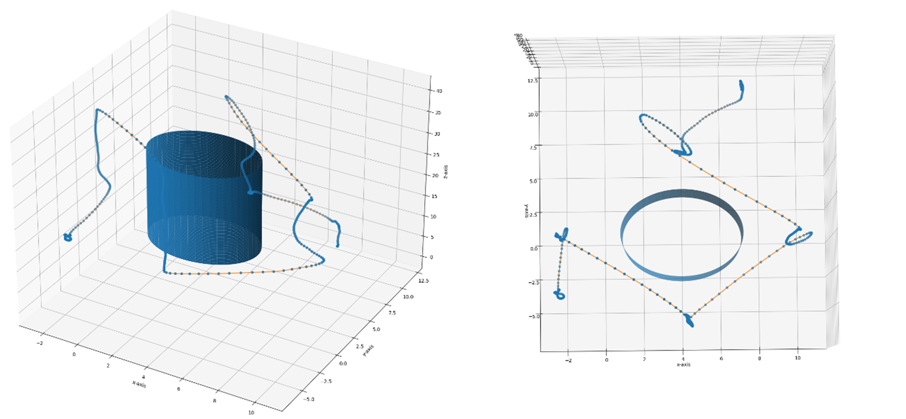

# Project Flight Control

## MoSCoW requirements
The following highlights the priorities for the projects.

**Must** 
```
1.	Must visually present the drone’s position in a 3D-space.
    a.	Must take a list of datapoints of data type double.
    b.	Must support interactive viewing.
    c.	Must display coordinate axes in meters.

2.	Must visually present the windmill in a 3D-space.
    a.	Must take user input for height and width.

3.	Must be programmed in Python version 3 or higher.

4.	Must be able to log the positional coordinates for the drone when a picture is taken.
    a.	Must be able to show in which direction the image was taken.
```
**Should**
```
1.	Should connect the drones position points in a 3D-space with lines/arrows.

2.	Should show the direction of the drone’s flight path.
```
**Could**
```
1.	Could visually present the drones flight in a 3D top-down perspective and log flight path on world map.

2.	Could account for the windmill’s rotation.

3.	Could show animation of drone's flight around the windmill.
```

**Won't**
```
1.	Won’t be implemented with commercially available GUI (Graphical User Interface).
```

## **Implementation**
---
The following seeks to document the implementation of the different versions of the software. The table below describes the major implementations of each version.

**Version control**
>| Version | Description |
>| - | - |
>| 1 | Cylinder creation, .csv parsing and plotting of drone >data. |
>| 2 | Creation of modules with specific responsibilities. Parsing of real datasets has also been implemented. |
>| 3 (tbd) | Plotting of image data in the interactive viewer. |

## **Version 1**

**Parsing a CSV-file**

---

As the drones `x-, y- and z-coordinates` will be saved to a `CSV-file` it is necessary to first implement a way to parse the file and extract the coordinates. The coordinates will be given as strings and so these will need to be cast to the double datatype.

```python
def printcsv():
    x = []
    y = []
    z = []
    with open('drone_local_position.csv') as csv_file:
        csv_reader = csv.reader(csv_file, delimiter=',')
        line_count = 0
        for row in csv_reader:
            x.append(row[0])
            y.append(row[1])
            z.append(row[2])
        x = list(map(float, x))
        y = list(map(float, y))
        z = list(map(float, z))
    return x, y, z
```

From the above implementation, the data is stored in the x, y and z lists and returned from the function.

**Plotting the data**

---

To test the `printcsv()` function, the drones coordinates are plotted in a 3D-interactive plot. It has been decided, that `Matplotlib` will be the main library to be used throughout the project for all plotting purposes. This decision stems from a consideration of the written documentation and ease of use that `Matplotlib` features.

Using `Matplotlib`, the interactive plot is first created by the following means:

```python
import matplotlib.pyplot as plt

fig = plt.figure()
ax = plt.axes('projection = 3d')
```

To plot the datapoints, we will be passing the returned lists from `printcsv()` to a `Matplotlib` function `ax.scatter()`

```python
x, y, z = printcsv()
ax.scatter(x, y, z)
```

**Creating a cylinder**

---

Next, we wish to create a cylindrical object for the drone’s flight path to be mapped around. This object is supposed to represent the windmill and is, for now, initialized with a specific `radius, height, x- and y-center and elevation`. It has been chosen to implement all this in a `Cylinder class`, to better encapsulate the data and implementation.

```python
class Cylinder:
    def __init__(self, radius = 1, height = 2, x_center = 0, y_center = 0, elevation = 0, color = 'b'):
        self.radius = radius
        self.height = height
        self.color = color
        self.x_center = x_center
        self.y_center = y_center
        self.resolution = 100
        self.elevation = elevation
```

It has been decided upon, that the cylinder will be created with the use of `meshes` to create the cylinder sides. The following shows the creation of the cylinder.

```python
def print_fig(self):
    z = np.linspace(self.elevation, self.elevation + self.height, self.resolution)    
    theta = np.linspace(0, 2*np.pi, self.resolution)    
    theta_grid, z_grid = np.meshgrid(theta, z)
    x_grid = self.radius * np.cos(theta_grid) + self.x_center
    y_grid = self.radius * np.sin(theta_grid) + self.y_center
    ax.plot_surface(x_grid, y_grid, z_grid, linewidth=0)
```

The `theta_grid` defines the resolution of the sides, the amount of sides to be used in creation of the cylinder. The bigger the `resolution`, the more sides are added to the cylinder and the 'rounder' it becomes.

The `x-` and `y-grids` create the centerfolds for the cylinder.

**V1 results**

---
The following image showcases the results from the implementation of version 1:
> 

## **Version 2**
---
For **version 2.0** we wanted to implement more features which takes advantage of the full dataset from the drone’s flight. This includes such things as *pitch, roll and yaw*, as well as *positional values for images* taken during inspection. A few more implementation criterias has also been set by the product owner and are as follows:

- Map top and bottom z-values with coordinates and timestamp.
- Write image timestamps as well as x-, y- and z-coordinates in the graph
- Visualize the drones orientation with an arrow.
- Adding images/video of drone flight in sidepanel and/or interactive plot where images can be extracted when scatter-point is clicked.

**Implementing script with modules**

---
As the script evolves with the requirements set by the product owner, so does the scope of the script. This has influenced us to divide the responsibilities of the script into ***separate modules***. This is done to keep `main` tidy, as well as create a more friendly development environment.
The cylinder class, along with some of the matplotlib features, in one class, `Draw`.

Reading CSV files and handling data is collected in another class, `DataHandler`.

### **The DataHandler Class**
---

The following provides a short overview of the DataHandler Class and its methods:

- `read_csv(self, id)`: Used for parsing csv files 
- `find_start(self, start_time, all_time)`: Used to find the inspection starting time.
- `offset(self, x, y, z, roll, pitch, yaw, w, offset, lead_up=10)`: Adds the offset from beforementioned `find_start` method to the datasets, such that the plot might only show the relevant inspection data.
- `euler_from_quaternion(self, xq, yq, zq, wq)`: Converts quaternions into Euler angles (roll, pitch and yaw).
- `get_maxmin(self, x, y, z)`: Gets the maximum and minimum values for x, y and z.

>For more information about each method as well as their implementations, refer to the [DataHandler source code](https://github.com/Olliyard/Upteko/blob/master/ProjectFlightPath/DataHandler.py)


**Parsing formatted CSV-files**

---
Besides the extra criterias set, we also received bunch of new `CSV files` to be parsed containing more than just the x-, y- and z-coordinates. 
The files include the following:

- **local_position_targets**: Linear representation of the drones flight. Used as a standard for the more random x-, y- and z-data.
- **drone_local_position**: File containing timestamps, x-, y- and z-coordinates as well as orientation data expressed as `quaternions`.
- **global_plan_generation_request**: This file contains all the information needed to determine the inspected cylinders values such as its *diameter, height and elevation*.
- **activate_offboard**: Contains the starting time for the inspection mission.

Since we are working with four different CSV files, we thought it best to create *switch .. case* in Python in the form of if .. elif statements. It matches a `string ID` given to the `read_csv` method and return the data corresponding to the `ID`.

```python
if id == "get_cylinder_values":
    #Parse global_plan_generation_request.csv and return the cylinder values.

elif id == "get_dlp":
    #Parse drone_local_position.csv and return the x-, y- and z-coordinates as lists, along with the orientation quaternions and timestamps.
elif id == "get_start":
    #Parse activate_offboard.csv and return the timestamp.
elif id == "get_camera":
    #Parse local_position_targets.csv and return the timestamps with camera data.
else:
    #Default error message
```

In general, the following has been used across all elif cases and is the general implementation of CSV parsing:

```python
import csv
import json

with open(id, 'r') as file:
    headers = ['column_1_name', .. 'column_n_name']
    csvreader = csv.DictReader(file, delimiter=',', fieldnames = headers)
    for i, row in enumerate(csvreader):
        if i == 0:
            continue
        if i > 0:
            list_name.append(row['column_name'])
            #In the case of json formatted data, such as the position and orientation data, the following was used:
            position = row['pose'].replace("'", "\"")
            cdict = json.load(position)
            x.append(cdict['position']['x'])
            quaternion_x.append(cdict['orientation']['x'])
        
    #Most time the data would be returned as strings, so mapping was needed:
    x = list(map(float, x))
    quaternion_x = list(map(float, quaternion_x))
return list_name, x, quaternion_x
```

By using this method of parsing the CSV files, we were able to succesfully extract all the data needed from each of the CSV files, depending on the ID passed to the method.

**Calculating quaternions to Euler Angles**

---


### **The Draw Class**
---
The following provides a short overview of the Draw Class and its methods:

- `draw_cylinder(self, diameter, height, x_center, y_center, elevation, resolution)`: Creates a cylinder according to the method described in the previous version documentation.
- `draw_dronepath(self, x, y, z, offset, with_arrow, step)`: Draws the drone datapoints in the plot.
- `draw_figure(self, title)`: Sets the axis' accordingly and shows the plot.
- `camera_plot(x, y, z, roll, pitch, yaw, length)`: Sets the orientation for each coordinate and plots it.
- `insert_image(self, path, type)`: Plots an image next to the plot.
- `annotate(self, x_place, y_place, text)`: Annotates a section of the plot.
- `annotate_maxmin_z(self, time, x, y, z, index_z_max, index_z_min)`: Annotates the max and min values for `z` with timestamps and coordinates.

>For more information about each method as well as their implementations, refer to the [Draw source code](https://github.com/Olliyard/Upteko/blob/master/ProjectFlightPath/Draw.py)

